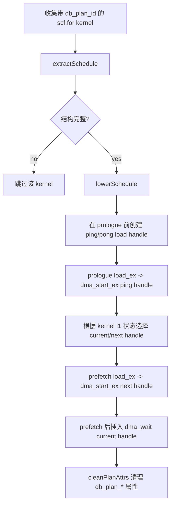
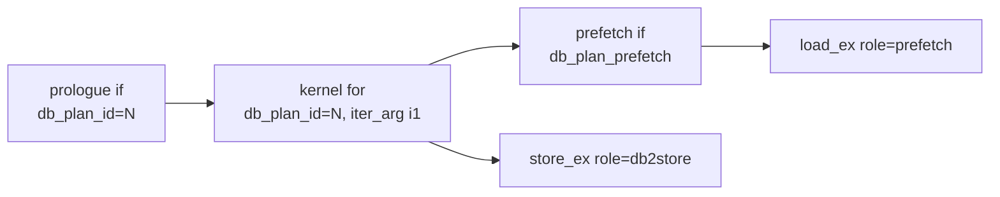
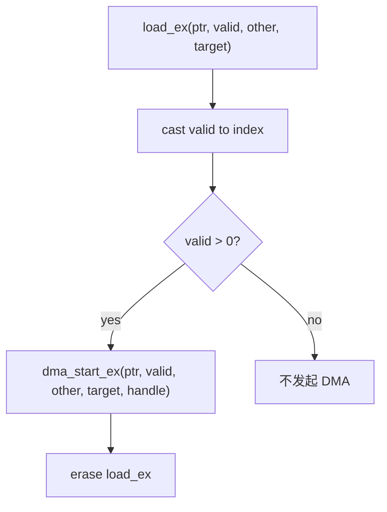
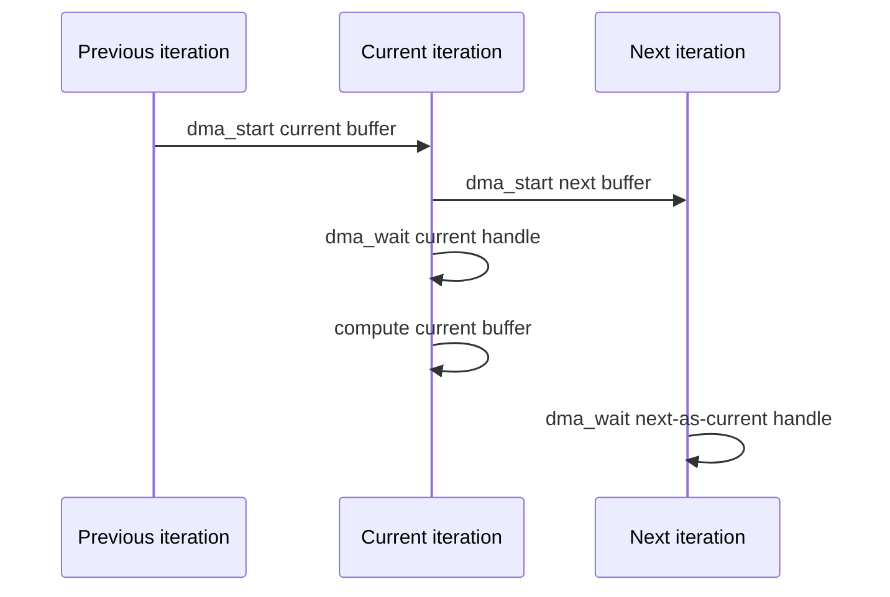

# HexagonDoubleBufferDMALoweringExtPass

`HexagonDoubleBufferDMALoweringExtPass` 消费
`HexagonDoubleBufferPlanRewriteExtPass` 生成的显式 double-buffer 结构和
`db_plan_*` 属性，把计划中的 `memref_ext.load_ex` 预取 lowered 成
`memref_ext.dma_start_ex`，并在 kernel loop 中插入对应的 `dma_wait`。

当前实现的重点是输入预取 DMA 化：

- prologue 中的 `load_ex[prefetch]` -> `dma_start_ex`，使用 ping handle。
- loop 内 prefetch 中的 `load_ex[prefetch]` -> `dma_start_ex`，使用 next handle。
- prefetch 后插入 `dma_wait(currentLoadHandle)`，保证当前轮 compute 使用的数据已经到达。
- `store_ex[db2store]` 参与 planned schedule 校验，但当前代码不会把 store lowered 成 DMA。
- lowering 完成后删除所有私有 `db_plan_*` 属性。

## 输入形态

该 pass 期望输入来自 `HexagonDoubleBufferPlanRewriteExtPass`：

```text
if has_first {                         [db_plan_prologue, db_plan_id = N]
  load_ex ... -> ping                  [db_plan_copy_role = prefetch]
}

scf.for ... iter_args(%cur: i1) {      [db_plan_id = N]
  scf.if has_next {                    [db_plan_prefetch]
    load_ex ... -> next buffer         [db_plan_copy_role = prefetch]
  }

  compute current buffer               [db_plan_compute]
  store_ex current buffer -> output    [db_plan_copy_role = db2store]
}
```

输出仍保留整体 double-buffer loop 结构，但 `load_ex` 预取被替换成 DMA start/wait。

## 总体流程



## 阶段 1：识别 planned kernel

`runOnOperation()` 收集所有带 `db_plan_id` 的 `scf.for`：

```mlir
scf.for ... iter_args(%cur = %true) -> (i1) {
  ...
} {db_plan_id = 0}
```

`extractSchedule()` 进一步校验：

- kernel 必须带 `db_plan_id`。
- kernel 必须有且只有一个 region iter arg。
- region iter arg 类型必须是 `i1`，用于 ping/pong 状态。
- kernel 前面必须能找到同 `db_plan_id` 的 `db_plan_prologue` `scf.if`。
- kernel body 内必须能找到 `db_plan_prefetch` `scf.if`。
- prologue loads 和 next loads 都非空，数量相等。
- kernel body 内必须有 `db2store` role 的 `store_ex`。



如果这些条件不满足，该 kernel 会被跳过。只有 `lowerSchedule()` 失败才会
`signalPassFailure()`。

## 阶段 2：收集 role transfer

`collectRoleLoads()` 在 prologue/prefetch 的 then block 中收集：

```mlir
memref_ext.load_ex ... {db_plan_copy_role = "prefetch"}
```

`collectRoleStores()` 在 kernel body 中收集：

```mlir
memref_ext.store_ex ... {db_plan_copy_role = "db2store"}
```

store 当前只用于确认 planned structure 中存在写回阶段。代码没有替换 store。

## 阶段 3：创建 DMA handle

`lowerSchedule()` 在 prologue 前创建两个 load handle：

```mlir
%ping_h = memref_ext.dma_handle
%pong_h = memref_ext.dma_handle
```

它们和 plan rewrite 中的 ping/pong buffer 对应：

| handle | 语义 |
| --- | --- |
| `pingLoadHandle` | ping buffer 上的 load DMA |
| `pongLoadHandle` | pong buffer 上的 load DMA |

prologue 总是预取第 0 轮到 ping，所以 prologue load 使用 `pingLoadHandle`。

## 阶段 4：prologue load lowering

原始 prologue：

```mlir
scf.if %has_first {
  memref_ext.load_ex %ptr0, %valid, %other, %ping
      {db_plan_copy_role = "prefetch", tensor_size = 128 : i32}
      : !tt.ptr<f32>, i32, f32, memref<128xf32>
}
```

lower 后：

```mlir
%ping_h = memref_ext.dma_handle
%pong_h = memref_ext.dma_handle

scf.if %has_first {
  %num = arith.index_cast %valid : i32 to index
  %positive = arith.cmpi sgt, %num, %c0 : index
  scf.if %positive {
    memref_ext.dma_start_ex %ptr0, %valid, %other, %ping, %ping_h
        {tensor_size = 128 : i32, is_other_valid = false}
        : ...
  }
}
```

实际代码通过 `createIfPositive()` 包一层 `scf.if numElements > 0`。
这样 valid size 为 0 时不会发起 DMA。

流程图：



## 阶段 5：loop 内 prefetch lowering

kernel loop 里有一个 `i1` 状态 `%cur`：

```mlir
scf.for ... iter_args(%cur = %true) -> (i1) {
  %next = arith.xori %cur, %true : i1
  scf.if %has_next {
    memref_ext.load_ex ... -> %next_buffer {db_plan_copy_role = "prefetch"}
  }
  compute current buffer
  store current buffer
  scf.yield %next : i1
}
```

lowering 根据 `%cur` 选择当前轮和下一轮 handle：

```mlir
%currentLoadHandle = arith.select %cur, %ping_h, %pong_h
%nextLoadHandle    = arith.select %cur, %pong_h, %ping_h
```

语义：

| `%cur` | current buffer | current handle | next buffer | next handle |
| --- | --- | --- | --- | --- |
| true | ping | ping handle | pong | pong handle |
| false | pong | pong handle | ping | ping handle |

prefetch then block 中的 `load_ex[prefetch]` 会被替换成：

```mlir
scf.if %has_next {
  scf.if %valid_positive {
    memref_ext.dma_start_ex ..., %nextLoadHandle
  }
}
```

## 阶段 6：插入 wait

loop 内 prefetch lowering 完成后，pass 在 prefetch `scf.if` 后插入：

```mlir
memref_ext.dma_wait %currentLoadHandle
```

位置关系：

```text
Before lowering:
  if has_next:
    load_ex next buffer
  compute current buffer
  store current buffer

After lowering:
  if has_next:
    dma_start_ex next buffer using nextLoadHandle
  dma_wait currentLoadHandle
  compute current buffer
  store current buffer
```

为什么等待 current handle 而不是 next handle：

- 当前轮 compute 使用的是上一轮已经预取好的 current buffer。
- 本轮开头启动的是下一轮 prefetch。
- wait current handle 保证当前 buffer 的 DMA 已完成，然后 compute 可以安全读取。
- next handle 的 DMA 会在下一轮变成 current handle 后再等待。



## 阶段 7：清理 plan 属性

`cleanPlanAttrs()` walk 整个 function，删除：

- `db_plan_id`
- `db_plan_prologue`
- `db_plan_prefetch`
- `db_plan_compute`
- `db_plan_copy_role`

这些属性只服务 plan rewrite 和 DMA lowering。lowering 完成后删除，避免泄漏到后续
pipeline。

## 完整前后示例

### Before

```text
%ping_h/%pong_h 尚不存在

if has_first [prologue]:
  load_ex first -> ping [prefetch]

for iv iter_args(cur):
  if has_next [prefetch]:
    load_ex next -> next buffer [prefetch]

  compute current buffer
  store_ex current buffer -> output [db2store]
```

### After

```text
%ping_h = dma_handle
%pong_h = dma_handle

if has_first:
  if first_valid > 0:
    dma_start_ex first -> ping, %ping_h

for iv iter_args(cur):
  %current_h = select cur, %ping_h, %pong_h
  %next_h    = select cur, %pong_h, %ping_h

  if has_next:
    if next_valid > 0:
      dma_start_ex next -> next buffer, %next_h

  dma_wait %current_h

  compute current buffer
  store_ex current buffer -> output
```

## 结构校验失败场景

`extractSchedule()` 返回 false 并跳过当前 kernel：

- kernel 没有 `db_plan_id`。
- kernel 没有单个 `i1` iter arg。
- 找不到匹配 `db_plan_id` 的 prologue。
- 找不到 loop 内 `db_plan_prefetch`。
- prologue/prefetch 中没有 `prefetch` role load。
- prologue load 数量和 next load 数量不同。
- kernel body 中没有 `db2store` role store。

`lowerSchedule()` 返回 failure 并触发 pass failure：

- `replaceLoadWithDMAStart()` 创建正数 guard 或 `dma_start_ex` 失败。

## 与 PlanRewriteExt 的配合

`HexagonDoubleBufferPlanRewriteExtPass` 负责生成计划结构：

```text
db_plan_id
db_plan_prologue
db_plan_prefetch
db_plan_copy_role = prefetch/db2store
```

`HexagonDoubleBufferDMALoweringExtPass` 负责消费这些属性：

```text
prefetch load_ex -> dma_start_ex
insert dma_wait for current handle
remove db_plan_* attrs
```

因此推荐 pipeline 顺序是：

```text
schedule-double-buffer-load-store-ext
hexagon-double-buffer-plan-rewrite-ext
hexagon-double-buffer-dma-lowering-ext
```
