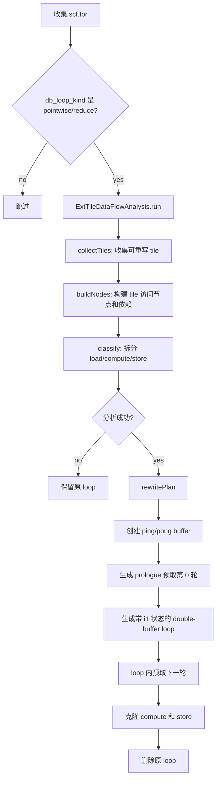
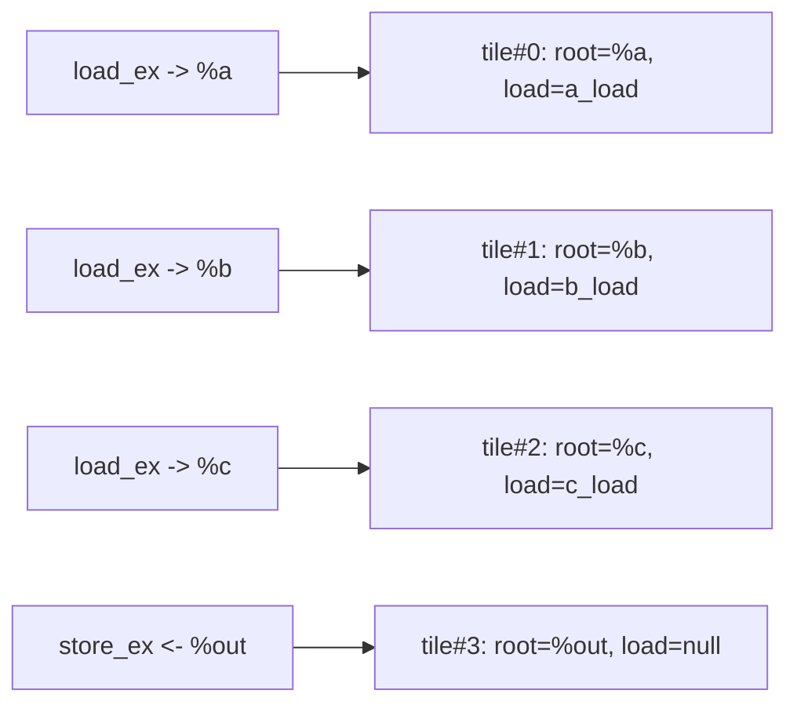
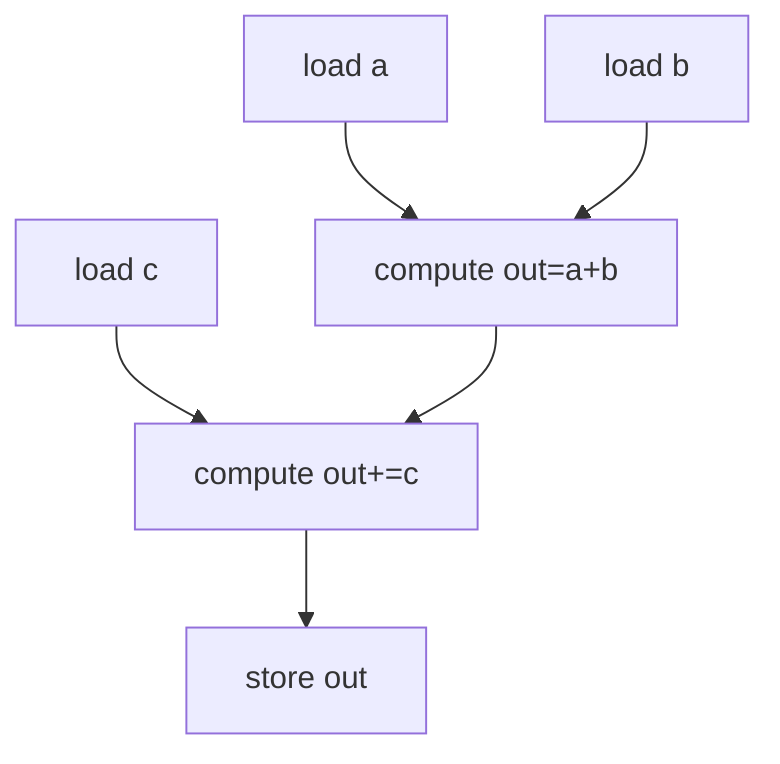
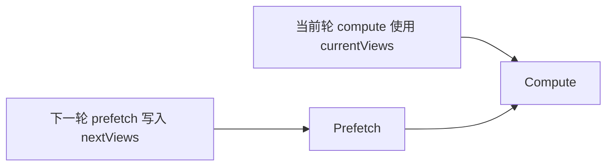

# HexagonDoubleBufferPlanRewriteExtPass

`HexagonDoubleBufferPlanRewriteExtPass` 消费已经被调度成 load/compute/store
形态的 `memref_ext.load_ex/store_ex` loop，把原始 `scf.for` 改写成显式
double-buffer 结构：

```text
prologue: 预取第 0 轮到 ping
kernel loop:
  预取下一轮到 pong/ping
  compute 当前轮
  store 当前轮结果
  翻转 ping/pong 状态
```

它负责创建 shared-memory ping/pong buffer、克隆原 loop 内的 load/compute/store，
并打上 `db_plan_*` 属性供 `HexagonDoubleBufferDMALoweringExtPass` 继续 lowering。

## 入口条件

`runOnOperation()` 会收集函数中的所有 `scf.for`，只重写带有以下 loop kind 的循环：

```mlir
{db_loop_kind = "pointwise"}
{db_loop_kind = "reduce"}
```

其他 loop 保持不变。`reduce` loop 允许没有显式 store；`pointwise` loop 必须能分类出
compute 和 store。

## 总体流程



## 示例输入

以下示例使用 `ScheduleDoubleBufferLoadStoreExtPass` 调度后的简化顺序：

```text
load a -> load b -> load c -> compute(out=a+b) -> compute(out+=c) -> store out
```

对应的原始 loop 结构：

```mlir
scf.for %iv = %c0 to %n step %c128 {
  %a = memref.alloc() : memref<128xf32>
  memref_ext.load_ex %a_ptr, %valid, %cst, %a : ...

  %b = memref.alloc() : memref<128xf32>
  memref_ext.load_ex %b_ptr, %valid, %cst, %b : ...

  %c = memref.alloc() : memref<128xf32>
  memref_ext.load_ex %c_ptr, %valid, %cst, %c : ...

  linalg.map { arith.addf } ins(%a, %b) outs(%out)
  linalg.map { arith.addf } ins(%out, %c) outs(%out)
  memref_ext.store_ex %d_ptr, %out, %valid : ...
} {db_loop_kind = "pointwise"}
```

## 阶段 1：收集 tile

`collectTiles()` 扫描 loop body：

- `load_ex target` 作为输入 tile，并记录该 tile 的唯一 `load_ex` 模板。
- `store_ex value` 作为输出或 store-only tile。
- tile root 必须能通过 `findMemoryRoot()` 追到本地 `memref.alloc`。
- tile root 必须在后续克隆位置可用。



前后变化：

| 输入 IR | Plan 中的 tile |
| --- | --- |
| `%a` 被 `load_ex` 写入 | 需要 ping/pong，记录 `a_load` |
| `%b` 被 `load_ex` 写入 | 需要 ping/pong，记录 `b_load` |
| `%c` 被 `load_ex` 写入 | 需要 ping/pong，记录 `c_load` |
| `%out` 被 `store_ex` 读取 | 不需要 pong，始终用同一份 buffer |

同一 tile 如果出现多个 `load_ex`，分析失败。原因是 prologue 和 steady-state
prefetch 模板要求每个输入 tile 只有一个预取来源。

## 阶段 2：构建数据流节点

`buildNodes()` 把 loop body 中访问计划 tile 的操作转成 `TileNode`：

- `load_ex`：标记 `isLoad`，对 target tile 记 `TileWrite`。
- `store_ex`：标记 `isStore`，对 value tile 记 `TileRead`。
- compute 或其他内存 op：优先用 `MemoryEffectOpInterface` 判断读写。
- 精确 effect 不可用时，用 alias analysis 的 ModRef 对每个 tile 保守建依赖。

示例节点：

```text
[0] LOAD_EXT   tile#0:WRITE
[1] LOAD_EXT   tile#1:WRITE
[2] LOAD_EXT   tile#2:WRITE
[3] COMPUTE    tile#0:READ, tile#1:READ, tile#3:WRITE
[4] COMPUTE    tile#2:READ, tile#3:READ_WRITE
[5] STORE_EXT  tile#3:READ
```

## 阶段 3：构建依赖并分类

依赖构建与 schedule pass 一样，按 tile 维护：

- `lastWrite[tile]`
- `readsSinceWrite[tile]`

形成 RAW/WAR/WAW 的前驱集合。随后 `classify()` 把节点拆成：

```text
loads    : 原始 load_ex，不直接放入 plan.computes
computes : 非 load/store 的 tile 访问 op
stores   : store_ex，放到 compute 后克隆
```



分类前后变化：

| 节点类型 | 重写时去向 |
| --- | --- |
| `LOAD_EXT` | prologue 和 loop 内 prefetch 区域 |
| `COMPUTE` | double-buffer loop body 中当前轮 compute 区域 |
| `STORE_EXT` | compute 后的当前轮写回区域 |

## 阶段 4：创建 ping/pong buffer

`rewritePlan()` 会在原 loop 前创建 buffer：

```mlir
%a_ping = memref.alloc() : memref<128xf32, #shared>
%a_pong = memref.alloc() : memref<128xf32, #shared>
%b_ping = memref.alloc() : memref<128xf32, #shared>
%b_pong = memref.alloc() : memref<128xf32, #shared>
%out_buf = memref.alloc() : memref<128xf32, #shared>
```

规则：

- 有 `load_ex` 的 tile 分配 ping 和 pong 两份 buffer。
- store-only 或临时 tile 只分配一份 buffer。
- tile 类型必须是静态 shape 的 ranked `MemRefType`。
- buffer 使用 `triton::kSharedMemorySpace`。

## 阶段 5：生成 prologue

prologue 用于在进入 steady-state loop 前预取第 0 轮数据：

```mlir
%has_first = arith.cmpi slt, %lb, %ub : index
scf.if %has_first {
  // iv 映射到 first
  // tile root 映射到 ping buffer
  memref_ext.load_ex ... -> %a_ping {db_plan_copy_role = "prefetch"}
  memref_ext.load_ex ... -> %b_ping {db_plan_copy_role = "prefetch"}
  memref_ext.load_ex ... -> %c_ping {db_plan_copy_role = "prefetch"}
} {db_plan_id = ..., db_plan_prologue}
```

前后变化：

| 原始 loop 内 load | prologue 中 load |
| --- | --- |
| 使用原始 `%iv` | 使用 first iteration 下标 |
| 写入原始 tile root | 写入 ping buffer |
| 没有 plan role | 标记 `db_plan_copy_role = prefetch` |

空 loop 时不会执行 prologue，避免越界预取。

## 阶段 6：生成 double-buffer loop

新 loop 携带一个 `i1` region iter arg 表示当前轮选择 ping 还是 pong：

```mlir
%true = arith.constant true
scf.for %iv = %lb to %ub step %step iter_args(%cur = %true) -> (i1) {
  %next = arith.xori %cur, %true : i1
  ...
  scf.yield %next : i1
}
```

每轮生成两组 view：

```text
currentViews: 本轮 compute/store 使用的 buffer
nextViews   : 下一轮 prefetch 写入的 buffer
```

对于需要双缓冲的 tile：

```text
cur == true  : current = ping, next = pong
cur == false : current = pong, next = ping
```

对于 store-only tile：

```text
current = same buffer
next    = same buffer
```

## 阶段 7：loop 内预取下一轮

在新 loop 开头生成下一轮预取：

```mlir
%next_iv = arith.addi %iv, %step : index
%has_next = arith.cmpi slt, %next_iv, %ub : index
scf.if %has_next {
  // iv 映射到 next_iv
  // tile root 映射到 nextViews
  memref_ext.load_ex ... -> %a_next {db_plan_copy_role = "prefetch"}
  memref_ext.load_ex ... -> %b_next {db_plan_copy_role = "prefetch"}
  memref_ext.load_ex ... -> %c_next {db_plan_copy_role = "prefetch"}
} {db_plan_prefetch}
```

最后一轮没有下一块数据，因此 `%has_next` 为 false 时跳过 prefetch。



注意：这里的 IR 顺序是 prefetch 在 compute 前。后续 DMA lowering 会把它变成
`dma_load_ex`，再在 prefetch 后插入等待当前轮 load handle 的 `dma_wait`，从而形成
“下一轮 DMA 与当前轮 compute 重叠”的结构。

## 阶段 8：克隆 compute 和 store

`cloneMappedOp()` 和 `cloneSlice()` 保证克隆后的 op 使用新 buffer：

- 原 loop iv 映射到新 loop iv。
- 原 tile root 映射到 `currentViews[index]`。
- op 之前的本地地址/shape 计算会按需克隆。
- compute 克隆会打 `db_plan_compute`。
- store 克隆会打 `db_plan_copy_role = db2store`。

示例：

```text
Before:
compute(%a, %b -> %out)
store(%out -> %d_ptr)

After:
compute(%a_current, %b_current -> %out_current) {db_plan_compute}
store(%out_current -> %d_ptr) {db_plan_copy_role = db2store}
```

## 完整前后示例

### Before

```text
for iv:
  load a -> tile a
  load b -> tile b
  load c -> tile c
  compute out = a + b
  compute out = out + c
  store out
```

### After

```text
alloc a_ping, a_pong
alloc b_ping, b_pong
alloc c_ping, c_pong
alloc out_buffer

if has_first:
  load a(first) -> a_ping     [prefetch]
  load b(first) -> b_ping     [prefetch]
  load c(first) -> c_ping     [prefetch]

for iv iter_args(cur = true):
  next = !cur

  currentViews = select(cur, ping, pong)
  nextViews    = select(cur, pong, ping)

  if has_next:
    load a(next_iv) -> a_next [prefetch]
    load b(next_iv) -> b_next [prefetch]
    load c(next_iv) -> c_next [prefetch]

  compute currentViews
  store currentViews[out]     [db2store]
  yield next
```

## Plan 属性

该 pass 会写入以下属性，供 DMA lowering 识别结构：

| 属性 | 位置 | 作用 |
| --- | --- | --- |
| `db_plan_id` | prologue if 和新 loop | 关联同一个 rewrite plan |
| `db_plan_prologue` | prologue `scf.if` | 标记首轮预取区域 |
| `db_plan_prefetch` | loop 内 prefetch `scf.if` | 标记下一轮预取区域 |
| `db_plan_compute` | 克隆 compute op | 标记当前轮计算 |
| `db_plan_copy_role` | 克隆 transfer op | 区分 `prefetch` 和 `db2store` |

## 保守失败场景

- loop 没有 `db_loop_kind = pointwise/reduce`。
- tile root 追不到本地 `memref.alloc`。
- tile root 不支配 load/store 使用点。
- 同一 tile 有多个 `load_ex` 来源。
- compute/store 访问无法映射到计划 tile。
- tile type 不是静态有秩 memref。
- `pointwise` loop 没有 compute 或没有 store。

失败时 pass 保留原 loop，不做结构化重写。
