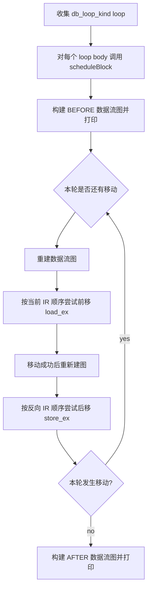
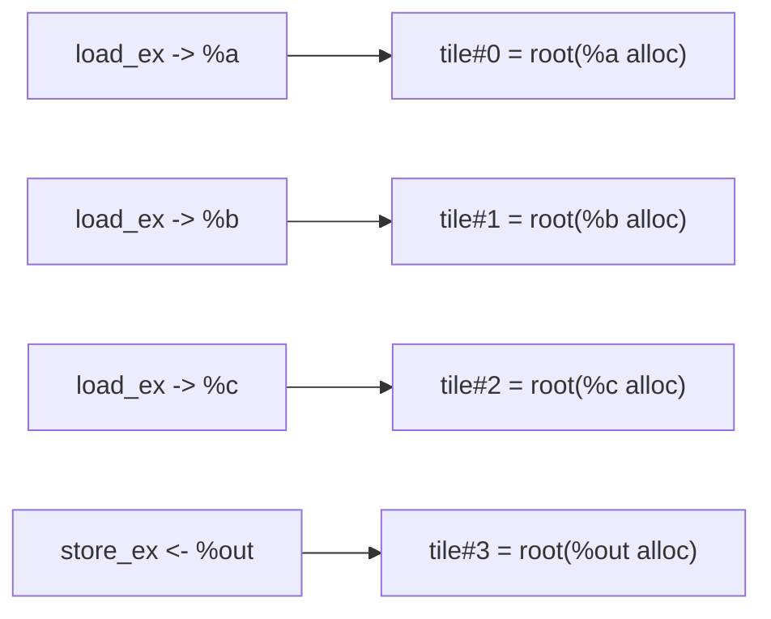
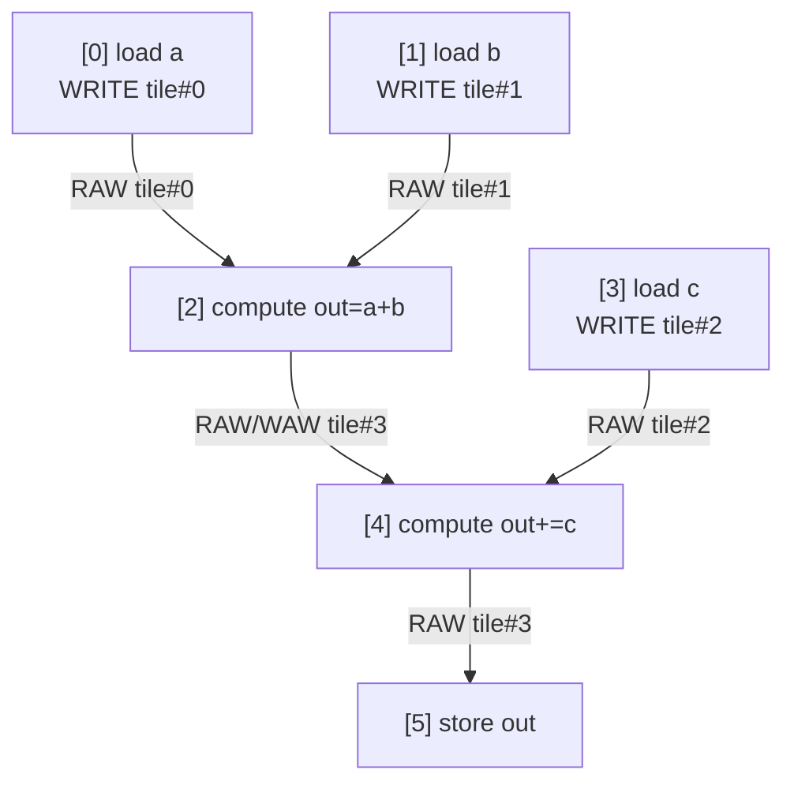
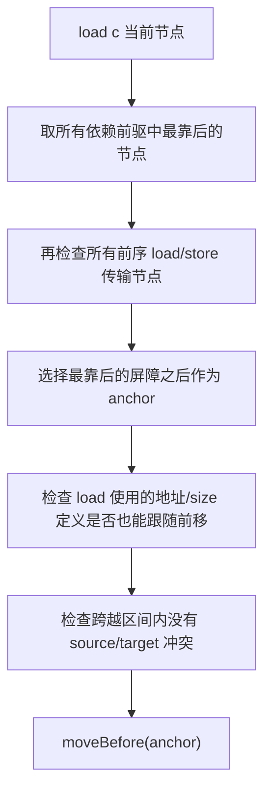
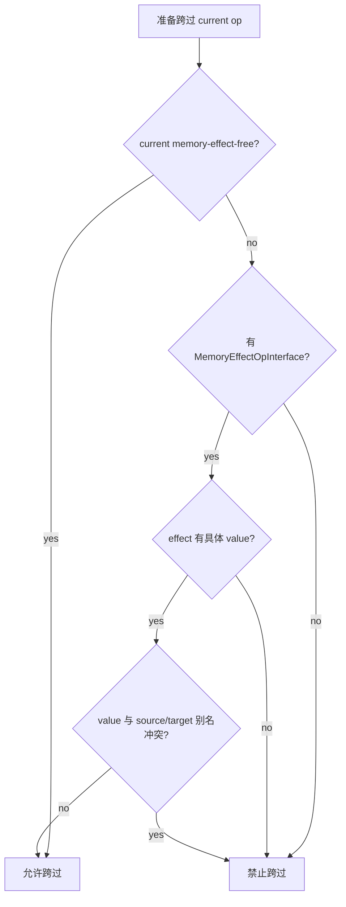

# ScheduleDoubleBufferLoadStoreExtPass

`ScheduleDoubleBufferLoadStoreExtPass` 在标记为 double-buffer 候选的
`scf.for` loop body 内重排 `memref_ext.load_ex` 和 `memref_ext.store_ex`：

- `load_ex` 尽量前移，以便更早发起输入预取。
- `store_ex` 尽量后移，以便把输出写回推到计算完成之后。
- 所有移动都受 tile 级数据依赖、传输顺序、别名分析和未知副作用约束。

该 pass 不改写 loop 结构，也不生成 ping/pong buffer；它只调整同一个 block
里的操作顺序，为后续 `HexagonDoubleBufferPlanRewriteExtPass` 和 DMA lowering
提供更清晰的 load/compute/store 形态。

## 入口条件

`runOnOperation()` 只处理带有 `db_loop_kind` 属性的 `scf.for`：

```mlir
scf.for %iv = %c0 to %n step %c128 {
  ...
} {db_loop_kind = "pointwise"}
```

未标记的 loop 会被跳过。这个约束来自 pass 对 double-buffer IR 形态的假设：
loop body 内的本地 `memref.alloc` tile、`load_ex`、compute、`store_ex`
共同构成可调度的数据流。

## 总体流程



每一轮移动后都重新构建依赖图。原因是一次 `load_ex` 前移或 `store_ex`
后移会改变节点顺序，后续锚点和冲突检查必须基于最新 IR。

## 示例输入

以下示例抽取自 `resources/db_load_store_ext.mlir` 的核心结构：

```mlir
scf.for %iv = %c0 to %n step %c128 {
  %a_ptr = tt.addptr %arg0, %iv_i32
  %a = memref.alloc() : memref<128xf32>
  memref_ext.load_ex %a_ptr, %valid, %cst, %a : ...

  %b_ptr = tt.addptr %arg1, %iv_i32
  %b = memref.alloc() : memref<128xf32>
  memref_ext.load_ex %b_ptr, %valid, %cst, %b : ...

  linalg.map { arith.addf } ins(%a, %b) outs(%out)

  %c_ptr = tt.addptr %arg2, %iv_i32
  %c = memref.alloc() : memref<128xf32>
  memref_ext.load_ex %c_ptr, %valid, %cst, %c : ...

  linalg.map { arith.addf } ins(%out, %c) outs(%out)

  %d_ptr = tt.addptr %arg3, %iv_i32
  memref_ext.store_ex %d_ptr, %out, %valid : ...
} {db_loop_kind = "pointwise"}
```

初始顺序可以简化为：

```text
load a -> load b -> compute(out = a + b) -> load c -> compute(out += c) -> store out
```

pass 希望把 `load c` 提前到不破坏依赖的最早位置，同时把 `store out`
后移到不破坏依赖的最晚位置。

## 阶段 1：收集 tile roots

`collectTiles()` 扫描 loop body，取 `load_ex` 的 target 和 `store_ex` 的 value，
再通过 `findMemoryRoot()` 追溯到根内存。

支持追溯的 view/cast 链包括：

- `memref.subview`
- `memref.cast`
- `memref.reinterpret_cast`
- `memref.view`
- `tt.addptr`

只有能追到 `memref.alloc` 的本地 tile 会进入调度模型。外部 memref 或 block
argument 没有明确的本地双缓冲槽，不能作为可重排 tile。



前后逻辑变化：

| 位置 | 输入 IR 视角 | 数据流视角 |
| --- | --- | --- |
| `%a` | `memref.alloc` 后被 `load_ex` 写入 | `tile#0` |
| `%b` | `memref.alloc` 后被 `load_ex` 写入 | `tile#1` |
| `%c` | `memref.alloc` 后被 `load_ex` 写入 | `tile#2` |
| `%out` | 被 compute 写入，最后被 `store_ex` 读取 | `tile#3` |

## 阶段 2：把操作抽象成节点

`collectNode()` 把访问 tile 的操作抽象成 `ExtNode`：

- `load_ex`：角色是 `LOAD_EXT`，对 target tile 记为 write。
- `store_ex`：角色是 `STORE_EXT`，对 value tile 记为 read。
- 其他带内存副作用的 op：读取 `MemoryEffectOpInterface`，按 effect value
  归类为 read/write。
- effect 没有关联具体 value 时：标记为 unknown memory effect，后续按读写所有 tile 处理。

示例节点：

```text
[0] LOAD_EXT   accesses={tile#0:WRITE}
[1] LOAD_EXT   accesses={tile#1:WRITE}
[2] COMPUTE    accesses={tile#0:READ, tile#1:READ, tile#3:WRITE}
[3] LOAD_EXT   accesses={tile#2:WRITE}
[4] COMPUTE    accesses={tile#2:READ, tile#3:READ_WRITE}
[5] STORE_EXT  accesses={tile#3:READ}
```

前后逻辑变化：

| IR 操作 | 抽象角色 | 访问摘要 |
| --- | --- | --- |
| `memref_ext.load_ex ..., %a` | `LOAD_EXT` | 写 `tile#0` |
| `linalg.map ins(%a, %b) outs(%out)` | `COMPUTE` | 读 `tile#0/#1`，写 `tile#3` |
| `memref_ext.load_ex ..., %c` | `LOAD_EXT` | 写 `tile#2` |
| `linalg.map ins(%out, %c) outs(%out)` | `COMPUTE` | 读 `tile#2/#3`，写 `tile#3` |
| `memref_ext.store_ex ..., %out` | `STORE_EXT` | 读 `tile#3` |

## 阶段 3：构建 RAW/WAR/WAW 依赖

`buildDependencies()` 对每个 tile 维护两个状态：

- `lastWrite[tile]`：该 tile 最近一次写者。
- `readsSinceWrite[tile]`：最近一次写之后发生的读者集合。

依赖规则：

```text
read  after write -> RAW：读必须看到最近写的版本
write after read  -> WAR：写不能提前覆盖读要看的旧值
write after write -> WAW：多个写必须保持最终覆盖顺序
```

示例依赖图：



前后逻辑变化：

| 构图前 | 构图后 |
| --- | --- |
| 只有线性 IR 顺序 | 每个节点知道自己不能越过哪些前驱 |
| `load c` 位于第一个 compute 后 | 只要不越过依赖和传输屏障，可以考虑前移 |
| `store out` 位于末尾 | 只要不越过消费者或后续传输，可以考虑后移 |

## 阶段 4：选择 `load_ex` 前移锚点

`getLoadAnchor()` 为每个 `load_ex` 找最早合法插入点。

锚点规则：

1. 不能越过任何前驱依赖。
2. 不能越过前序 `load_ex/store_ex`，以保持传输序列顺序。
3. 如果没有依赖和前序传输，锚点是 block 的第一个操作。

示例中，`load c` 对 `compute(out=a+b)` 没有数据依赖，但它前面已经有
`load a` 和 `load b`。因此它可以前移到这两个传输之后、第一个 compute 之前：

```text
Before:
load a -> load b -> compute(out=a+b) -> load c -> compute(out+=c) -> store out

After load scheduling:
load a -> load b -> load c -> compute(out=a+b) -> compute(out+=c) -> store out
```

对应流程：



## 阶段 5：跟随移动地址定义

`load_ex` 前移时，它的 operands 也必须在新位置可用。`collectMovableDefs()`
递归收集位于 `anchor` 和 `load_ex` 之间的本地定义，例如：

```mlir
%c_ptr = tt.addptr %arg2, %iv_i32
%c = memref.alloc() : memref<128xf32>
memref_ext.load_ex %c_ptr, %valid, %cst, %c : ...
```

如果 `load_ex` 前移，`%c_ptr` 和 `%c` 这类定义必须一起移动，否则
`load_ex` 会在新位置引用尚未定义的 SSA value。

前后变化：

```text
Before:
compute(out=a+b)
%c_ptr = ...
%c = memref.alloc()
load c

After:
%c_ptr = ...
%c = memref.alloc()
load c
compute(out=a+b)
```

只有 memory-effect-free 或 memref view/cast/alloc 这类地址/视图定义允许跟随移动。
有 region 或有语义副作用的 op 不会被提前。

## 阶段 6：跨越冲突检查

`hasConflictWhenCrossing()` 检查一个移动是否能跨过中间 op。

对 `load_ex source -> target`：

- 如果中间 op 写 source 或 source 的别名，不能前移。
- 如果中间 op 读/写 target 或 target 的别名，不能前移。
- 如果中间 op 没有 `MemoryEffectOpInterface`，保守视为冲突。
- 如果 effect 没有具体 value，保守视为冲突。

对 `store_ex value -> ptr`：

- 如果中间 op 写 value 或 value 的别名，不能后移。
- 如果中间 op 读/写 ptr 或 ptr 的别名，不能后移。



## 阶段 7：选择 `store_ex` 后移插入点

`getStoreInsertionPoint()` 为每个 `store_ex` 找最晚合法位置。

插入点规则：

1. 只看当前 store 之后的节点。
2. 遇到后续 `load_ex/store_ex`，不能越过，保持传输序列。
3. 遇到依赖当前 store 的后继节点，不能越过，保持数据可见顺序。
4. 如果没有后继屏障，可以移动到 terminator 之前。

一个 store 已经在末尾时不会产生变化：

```text
Before:
load a -> load b -> load c -> compute(out=a+b) -> compute(out+=c) -> store out

Store insertion point:
terminator 前，等于当前位置之后，没有实质移动

After:
load a -> load b -> load c -> compute(out=a+b) -> compute(out+=c) -> store out
```

若原始 IR 中 store 早于某些无关 compute，且这些 compute 不读写 store 的
value/ptr，也不是后续传输节点，则 store 可以后移：

```text
Before:
compute(out) -> store out -> compute(tmp)

After:
compute(out) -> compute(tmp) -> store out
```

## 阶段 8：迭代到稳定

一次移动会改变 IR 顺序，导致：

- 依赖节点编号变化。
- `load_ex` 的最早 anchor 变化。
- `store_ex` 的最晚 insertion point 变化。
- 后续跨越区间变化。

因此 `scheduleBlock()` 使用循环：

```text
while localChanged:
  rebuild graph
  move loads
  rebuild graph
  move stores in reverse order
```

反向处理 store 的原因是后移 store 时，靠后的 store 先处理可以减少插入点互相影响。

## 完整前后示例

### Before

```text
1. %a_ptr / %a / load a
2. %b_ptr / %b / load b
3. compute out = a + b
4. %c_ptr / %c / load c
5. compute out = out + c
6. store out
```

### Dataflow

```text
load a -> compute#1  (RAW tile#a)
load b -> compute#1  (RAW tile#b)
compute#1 -> compute#2 (RAW/WAW tile#out)
load c -> compute#2  (RAW tile#c)
compute#2 -> store out (RAW tile#out)
```

### After

```text
1. %a_ptr / %a / load a
2. %b_ptr / %b / load b
3. %c_ptr / %c / load c
4. compute out = a + b
5. compute out = out + c
6. store out
```

逻辑变化总结：

| 流程 | Before | After | 为什么安全 |
| --- | --- | --- | --- |
| tile 收集 | IR value 分散在 load/store operands 中 | 统一为 tile root index | 同一内存的 view/cast/addptr 不会漏判 |
| 节点抽象 | 线性 IR 操作 | `LOAD_EXT/COMPUTE/STORE_EXT` + read/write 集合 | 后续移动只看数据流摘要 |
| 依赖构建 | 只有原始顺序 | RAW/WAR/WAW 边 | 明确哪些顺序不能交换 |
| load 前移 | `load c` 在 compute#1 后 | `load c` 到 compute#1 前 | `load c` 不依赖 compute#1，且不越过前序传输 |
| 地址定义跟随 | `%c_ptr/%c` 在 load 前 | 与 load 一起前移 | 保持 SSA 支配关系 |
| store 后移 | store 尝试后移 | 无后续空间则不变 | 不能越过后续传输或消费者 |

## 常见保守退出场景

- loop 没有 `db_loop_kind`：pass 不处理。
- `load_ex` target 追不到本地 `memref.alloc`：不作为 tile 调度。
- 中间 op 没有 `MemoryEffectOpInterface`：移动不能跨过。
- effect 没有具体内存 value：视为未知内存影响。
- load 前移需要带上的 operand definition 不是纯地址/视图计算：放弃该移动。
- 移动跨越区间里存在 source/target/value/ptr 的别名冲突：放弃该移动。

## 与后续 pass 的关系

`ScheduleDoubleBufferLoadStoreExtPass` 的输出仍然是普通 loop body，只是顺序更利于
后续重写：

```text
load/preload cluster -> compute cluster -> store cluster
```

`HexagonDoubleBufferPlanRewriteExtPass` 随后可以基于这种顺序更容易生成：

```text
prologue load first tile
loop:
  prefetch next tile
  compute current tile
  store current tile
```

这个 pass 的核心价值是：在真正做结构化 double-buffer rewrite 前，用局部数据流
把 `load_ex/store_ex` 调度到更接近理想流水线的位置，同时不破坏原 IR 的内存语义。
